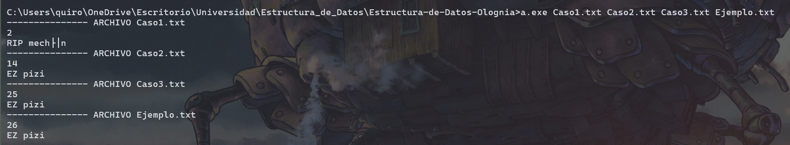

# Estructura-de-Datos-Olognia
Repositorio para el Entregable 1 del ramo Estructura de Datos.
Integrantes: Valeria Quiroga, Bastián Bernal.

Entrada: Lee un archivo tipo TXT con el siguiente formato. Si al llamar al programa se pasa un nombre de archivo, se ejecutará ese, en el caso contrario se ejecutará Ejemplo.txt por default.

Ejemplo: .\a.exe Caso1.txt

- Primera linea: Número entero representando la vida del mechón.
- Segunda linea: Número entero representando la cantidad n de esbirros.
- Tercera linea: n números enteros representando la vida de los esbirros.
- Cuarta linea: n números enteros representando el ataque de los esbirros.
- Quinta linea: n números enteros representando si los esbirros son CANOs, con 0 si no lo es y 1 en el caso contrario.

Salida: un valor numérico y un texto separados por un salto de línea. El valor numérico corresponde al daño total que el mechón causó a los esbirros, mientras que el texto será "EZ pizi" si el mechón logra salvar al pueblo o "RIP mechón" si es que este no logra su cometido. En el caso del ingreso de varios archivos se indicará el nombre del archivo y las salidas estarán separadas por lineas.

